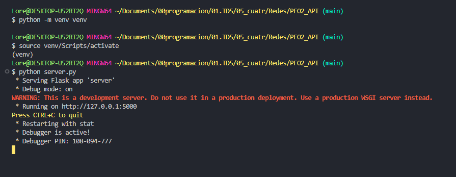
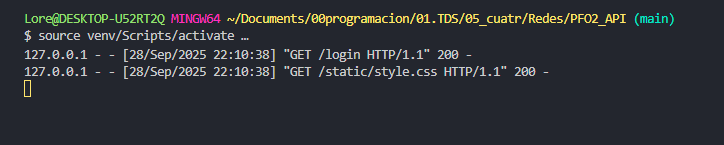
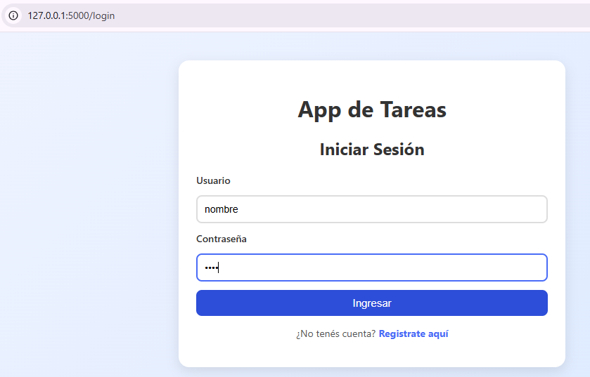
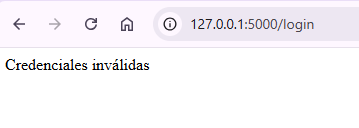
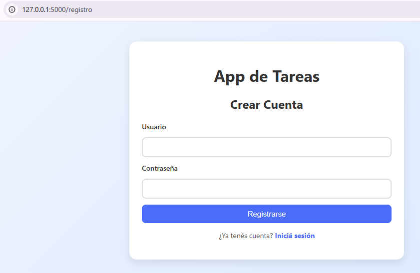
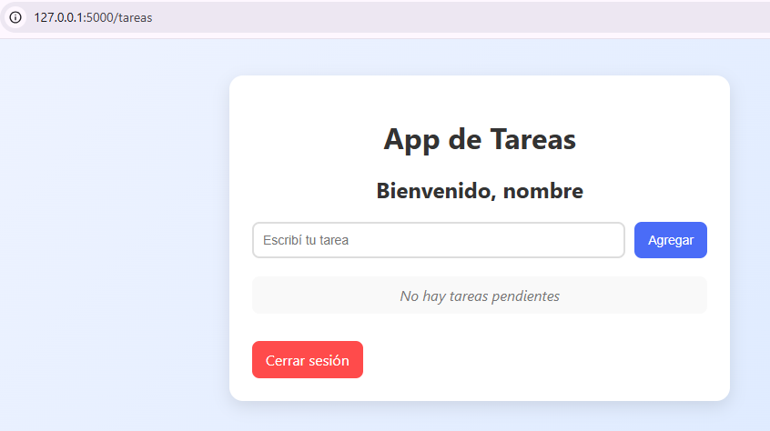
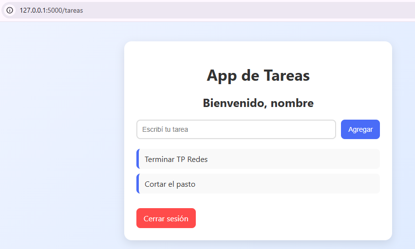
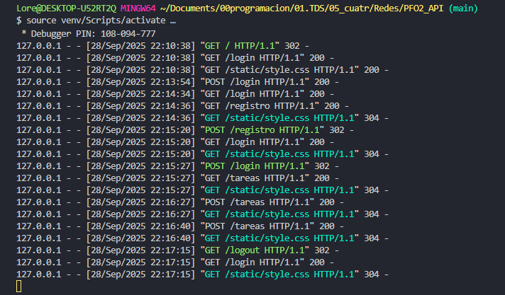

#  Sistema de Gestión de Tareas – API + SQLite  

Este proyecto implementa un sistema de gestión de tareas con autenticación de usuarios, utilizando **Flask** como framework web y **SQLite** como base de datos.  

Permite:  
- Registrar usuarios con contraseñas seguras (hasheadas).  
- Iniciar sesión.  
- Administrar tareas de manera persistente.  
- Visualizar las tareas desde una interfaz web sencilla.  

---

##  Tecnologías utilizadas  

- [Python 3](https://www.python.org/)  
- [Flask](https://flask.palletsprojects.com/)  
- [SQLite](https://www.sqlite.org/)  
- [Werkzeug Security](https://werkzeug.palletsprojects.com/) para el hashing de contraseñas.  
- HTML + CSS para la interfaz.  

---

## Estructura del proyecto  

```
📦 PFO2_API
┣ 📜 server.py
┣ 📜 init_db.py
┣ 📜 tareas.db
┣ 📜 requirements.txt
┣ 📜 README.md
┣ 📂 templates
┃ ┣ 📜 index.html
┃ ┣ 📜 login.html
┃ ┣ 📜 registro.html
┃ ┗ 📜 tareas.html
┗ 📂 static
  ┣📜 style.css
  ┗ 📂 screenshots 


```


---

## Instalación y ejecución  

1. Clonar el repositorio:  
 ```bash
   git clone https://github.com/Alexa-2k/REDES-PFO2_API
   cd REDES-PFO2_API
 ```


2. (Opcional, pero recomendado) Crear y activar un entorno virtual:

*Windows (PowerShell)*
```bash
python -m venv venv
venv\Scripts\Activate.ps1
```

*Windows (CMD)*
```bash
python -m venv venv
venv\Scripts\activate.bat
```

*Windows (Git Bash en VSCode)*
```bash
python -m venv venv
source venv/Scripts/activate
```

*Linux / Mac*
```bash
python -m venv venv
source venv/bin/activate
```

3. Instalar dependencias: 
```bash
pip install -r requirements.txt 
```

4. Inicializar la base de datos (solo la primera vez): 
```bash
python init_db.py 
```

5. Iniciar el servidor: 
```bash
python server.py 
```

6. Abrir en el navegador: http://127.0.0.1:5000 

## Base de datos y usuario precargado 

El sistema crea automáticamente una base de datos SQLite llamada tareas.db.

*La contraseña no se guarda en texto plano, sino hasheada con Werkzeug Security*

## Endpoints principales 

| Endpoint      | Método | Descripción                                         | Body JSON / Parámetros |
|---------------|--------|---------------------------------------------------|-----------------------|
| `/registro`   | POST   | Crear un nuevo usuario                             | `{ "usuario": "nuevo_usuario", "contraseña": "clave" }` |
| `/login`      | POST   | Iniciar sesión                                     | `{ "usuario": "nombre", "contraseña": "1234" }` |
| `/tareas`     | GET    | Mostrar lista de tareas del usuario autenticado   | -                     |
| `/tareas`     | POST   | Crear una nueva tarea                              | `{ "descripcion": "Mi nueva tarea" }` |
| `/logout`     | GET    | Cerrar sesión del usuario                          | -                     |


1. Registro de usuario POST /registro Body JSON: { "usuario": "nuevo_usuario", "contraseña": "clave" } 
2. Login POST /login Body JSON: { "usuario": "nombre", "contraseña": "1234" } 
3. Página de tareas GET /tareas Devuelve un HTML con la lista de tareas del usuario autenticado. 

### Respuestas Conceptuales 

*1. ¿Por qué hashear contraseñas?*

Porque almacenar contraseñas en texto plano es un gran riesgo de seguridad. Si alguien accede a la base de datos, tendría todas las claves expuestas. El hashing aplica un algoritmo unidireccional (ej. pbkdf2_sha256, bcrypt) que transforma la contraseña en una cadena irreconocible. Incluso si la base se filtra, no se pueden obtener fácilmente las contraseñas originales. 

*2. Ventajas de usar SQLite en este proyecto*

Es ligero y no requiere instalar un servidor de base de datos externo. El archivo .db es portable y fácil de versionar en GitHub. Perfecto para proyectos pequeños o prototipos. Compatible con SQL estándar. 

### Capturas de ejemplo 

1. Inicio del servidor



2. Abrir el navegador 



3. Login



4. Credenciales inválidas (usuario no registrado / datos erróneos)



5. Crear cuenta de nuevo usuario



6. Registrar nueva tarea



7. Listado de tareas



8. Proceso completo




